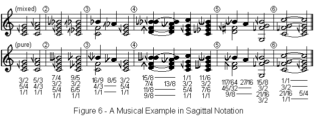

# Welcome

If you want to learn about the Sagittal microtonal notation system, you have come to the right place.

Sagittal is a notation **system** that makes possible many different microtonal **notations**. Whatever tuning you write in — a just intonation, an equal division of the octave, or something stranger — there is a Sagittal notation for it, built from the same shared set of arrow-shaped symbols.

### Still unsure about using Sagittal? Get acquainted here.



## Guides

In a hurry? Get what you need and be on your way.



Here to understand Sagittal on a deeper level? Take the scenic route instead.



## New to microtonal notation?

If you have never thought about how conventional sharps and flats actually work, start with The Chain of Fifths. It is short, and everything else builds on it.




Discussion about Sagittal happens on the [Sagittal Forum](http://forum.sagittal.org). If these pages don't answer your question, you're sure to find an answer there, or someone who can help.

