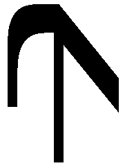
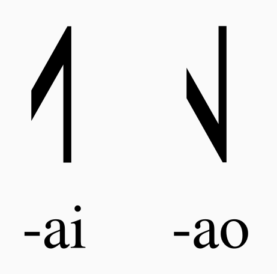
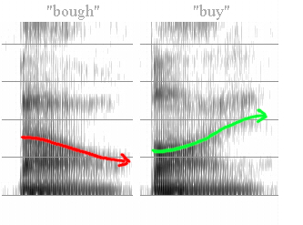

# Sagispeak

Sagispeak is the spelling and pronunciation scheme for Sagittal symbols.

It was designed to be as universally accessible as possible — easily spoken and written by native speakers of the most widely-spoken languages. Care was taken to avoid any spellings or pronunciations that do not exist in these languages. Care was also taken to avoid spellings or pronunciations which are ambiguous in any of these languages.

Each Sagittal symbol has at least one spelling and pronunciation. We can call either or both of these its "Sagispeak". So,  

> "The Sagispeak foris 'jakai'."

## Vowels

Every Sagittal symbol's Sagispeak ends with a vowel sound.

This vowel sound will be one of two diphthongs:

1. /aɪ/, spelled "ai"
2. /aʊ/, spelled "ao"

These are the same vowel sounds in English as in the words "high" and "down", respectively.

The first thing to notice about a Sagittal symbol is the direction it points: up or down. If it points up, it will end in "ai". If it points down, it will end in "ao".

For English-speakers, the shared pronunciation with "high" and "down" should be a helpful mnemonic:

> "ai, go high! ao, go down!"

The vowels /aɪ/ and /aʊ/ were originally chosen for a language-independent mnemonic: when you pronounce /aɪ/ the weighting of the harmonics in your voice sweeps upward in pitch, while when you pronounce /aʊ/ they sweep downwards. You can see this in sonograms:

