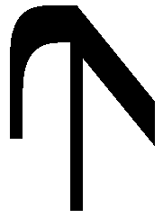
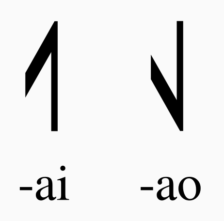
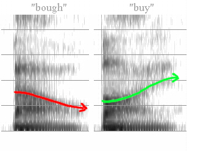

# Sagispeak

Sagispeak is the spelling and pronunciation scheme for Sagittal symbols.

It was designed to be as universally accessible as possible — easily spoken and written by native speakers of the most widely-spoken languages. Care was taken to avoid any spellings or pronunciations that don't exist in those languages, or that would be ambiguous in any of them.

Each Sagittal symbol has at least one spelling and pronunciation. We can call either or both of these its "Sagispeak." So:

> "The Sagispeak for  is 'jakai'."

## Vowels: the direction

Every Sagittal symbol's Sagispeak ends with a vowel sound — one of two diphthongs:

1. /aɪ/, spelled **"ai"**
2. /aʊ/, spelled **"ao"**

These are the same vowel sounds as in the English words "high" and "down."

The first thing to notice about a symbol is the direction it points. If it points **up**, its Sagispeak ends in **"ai"**; if it points **down**, it ends in **"ao"**.

For English-speakers, the shared sound with "high" and "down" is a handy mnemonic:

> "ai, go high! ao, go down!"

But the mnemonic is only post-hoc. The **real**, language-independent reason for the choice is acoustic: when you pronounce /aɪ/, the weighting of the harmonics in your voice sweeps **upward** in pitch, and when you pronounce /aʊ/ it sweeps **downward**. You can see this in sonograms:

## Consonants: the kind of alteration

The consonants before the vowel say *what kind* of up or down alteration it is — that is, which **flags** the symbol has. Only the eight flag types need consonants (left and right versions of the barb, arc, scroll, and boathook), and most consonants were chosen to **resemble the downward form of the flag**, often matching the [sagitype](sagitype.md) character for the downward symbol.

A few anchors:

* **p** = left barb — from the Greek *pente* ("five"), because the left barb is the 5-comma. So `\!`  is **pao** and `/|`  is **pai**.
* **k** = right barb — chosen for its appearance.
* **n** = right arc — `|(` is **nai**, `!(` is **nao**.
* **v** is reserved for the 11-diesis down `\!/`, which is why the 5-comma down doesn't use it.

Put a left-barb and a right-barb together and you get the full arrow `/|\` , spoken **pakai** (p + k) — "or possibly even 'kapow!'"

## The four spelling rules

Sagispeak is really also **Sagispell**: Dave and George deliberately favored **constant spelling over constant pronunciation**. Four rules govern how the pieces combine:

1. **One consonant letter per flag type** — one letter for each of the eight flags (usually resembling the downward flag, with or without a shaft).
2. **Double consonant → consonant + "h."** A doubled flag turns "pp" into "ph" (pronounced "f"), "ss" into "sh," "kk" into "kh," and so on.
3. **"a" separates left from right.** If a symbol has both a left flag and a right flag, a single **"a"** — which stands for the shaft — goes between the left-side consonants and the right-side consonants. The lone "a" **only ever** represents the shaft.
4. **End in "ai" (up) or "ao" (down).**

So `/|` (left barb up) is **pai**; `|)` (right, up) is **tai**; a symbol combining them takes a left consonant, then "a" for the shaft, then a right consonant, then the ending.

## Only single-shaft symbols get names


Only **single-shaft** symbols have Sagispeak names of their own. Multi-shaft (Revo) symbols are spoken as their **Evo** counterparts: the single-shaft Sagispeak plus "sharp" or "flat," placed before or after and joined or not, according to the language's convention. So `C#/|` is "C sharp pai" in English, or "Cispai" in a Finnish-style suffixing language.




## Internationalization

The Latin **spelling** is fixed; the **pronunciation** flexes by language. The scheme was built with cross-language pronounceability in mind — Dave even studied Japanese phonology while helping George design it, and Finnish (with fewer native phonemes than Japanese) served as the acid test. The letter **"j"** is the widest-ranging: it is /dʒ/ in English, /j/ in German, /ʒ/ in French, and /h/ in Spanish — which is exactly why the letters "h" and "y" are banned, and why confusable pairs (t/d, k/g, l/r) are avoided.

A handful of rare symbols get **per-language respellings** to avoid collisions or confusion:

* English (and similar): "kh" → **"ch"**
* French: "kh" → **"tch"** (plain "ch" would sound like /ʃ/)
* German: "sh" → **"sch"**

Fortunately, these are not commonly used symbols.

<!-- TODO: consider a compact table of the eight flags → consonants, and the diacritic (accent) sounds, once the symbol images are available. -->
