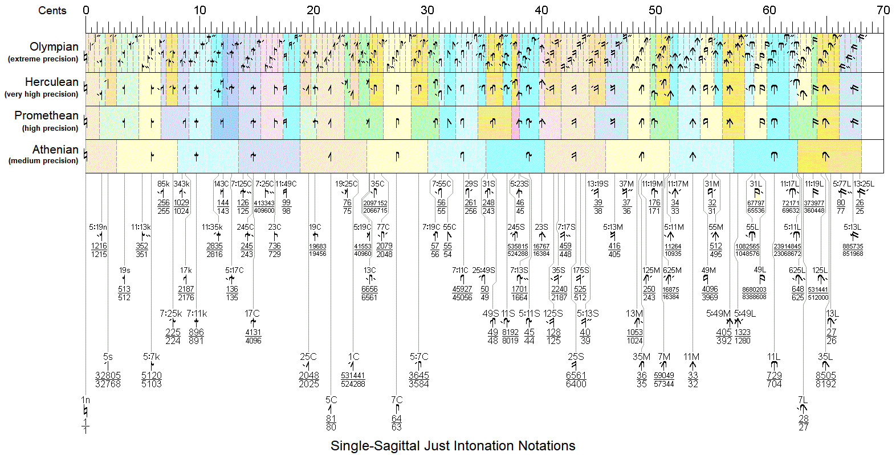

# JI Precision Levels

_This page is generated from the Sagittal data set; corrections belong in the data, not here._

Sagittal’s [Standard JI notation](../notation-how-to-guides/just-intonation.md) comes in four precision levels. Each finer level draws on a larger [symbol set](../concept-explanations/symbol-sets.md) and divides the apotome (113.685¢) into more equal steps (its **EDA** — equal divisions of the apotome), so the worst-case rounding error shrinks. Data is from `sheet/08-standard-ji-notations.csv`.

| Level | Symbol set | Symbols | EDA (steps/apotome) | Step size (¢) |
|---|---|---|---|---|
| Medium | Athenian | 13 | 21 | 5.41 |
| High | Promethean | 33 | 47 | 2.42 |
| Ultra | Herculean | 55 | 58 | 1.96 |
| Extreme | Olympian | 153 | 233 | 0.49 |

## The chart

The classic chart from [sagittal.org](https://sagittal.org) shows all four levels at once — each band is one precision level, each colored zone is a symbol's capture zone across the half-apotome, with its primary comma's ratio beneath:

<figure><figcaption>Single-Sagittal JI notations at every precision level. From sagittal.org.</figcaption></figure>


Two details of this chart predate later refinements: the **Olympian row is out of date** (it should use breves on the left rather than accents on the right), and the unison appears under its old name **1n** — today it is called **1u**. The tables on this page reflect the current conventions.


"Symbols" counts the distinct upward symbols appearing at that level in the source (cumulative — each level contains the coarser ones). The upward and downward halves each get this many, and every symbol has an [apotome complement](../concept-explanations/apotome-complements.md) for the far side of the apotome.

## The published baseline: Medium, High, Extreme

The table above is the current, finer-grained ladder. The **canonical published reference** — the 2006 *Xenharmonikôn* article — defines a coarser set of precision levels, and it remains the baseline every later refinement builds on. The article names three (p.25), with a low-precision option below them (fn.20):

| Published level | Symbols used | Modern set it lands on |
|---|---|---|
| Low-precision (SpartanJI) | Spartan, mapped to a consistent EDO | Spartan |
| **Medium** (Athenian) | 12 single-shaft pairs, no accents | Athenian |
| **High** | in versions with or without **schisma** accents | Promethean (without) / Herculean (with) |
| **Extreme** | **schisma + mina** accents | Olympian |

Two things to notice when comparing the two schemes:

- The article's **Medium = Athenian**, exactly as in the modern ladder; its resolution is "comparable to 224-EDO," the division in which the 5-schisma vanishes.
- The word **High** does not line up between the two schemes. The article's High-precision comes "in versions with or without schisma accents," so it spans two modern levels at once: the un-accented **Promethean** (the modern *High*) and the schisma-accented **Herculean** (the modern *Ultra*). The modern ladder simply splits the article's single High band into those two named steps. The article's **Extreme** (schisma + mina accents) is the modern **Olympian**.

For **low-precision SpartanJI**, the article's recipe (fn.20) is to map rational intervals onto a division of the octave that is consistent to the odd limit you need — e.g. **72-EDO for 11-limit JI** or **130-EDO for 15-limit JI** (130-EDO uses almost all of Spartan; 72-EDO uses the Spartan subset known as the "starter set").

## The Medium (Athenian) level

The coarsest level is the Athenian set. The article counts **twelve single-shaft altering pairs** here (the table below has thirteen rows because the first, `|`/`!`, is the bare shaft — the unison 1u — which does not alter pitch). With their mirrored downward twins they span the first half-apotome; their apotome complements and conventional sharps/flats cover the rest. Primary commas below are from `sheet/03-primary-commas.csv`.

| Up | Down | Primary comma | Size | ¢ | Sagispeak |
|---|---|---|---|---|---|
| `|` | `!` | 1u | n | 0.000 | ai |
| `|(` | `!(` | 5/7k | k | 5.758 | nai |
| `)|(` | `)!(` | 7/11k | k | 9.688 | ranai |
| `~|(` | `~!(` | 17C | C | 14.730 | sanai |
| `/|` | `\!` | 1/5C | C | 21.506 | pai |
| `|)` | `!)` | 1/7C | C | 27.264 | tai |
| `(|` | `(!` | 7/11C | C | 33.148 | jai |
| `(|(` | `(!(` | 5/11S | S | 38.906 | janai |
| `//|` | `\\!` | 1/25S | S | 43.013 | fai |
| `/|)` | `\\!)` | 1/35M | M | 48.770 | gai |
| `/|\` | `\!/` | 11M | M | 53.273 | vai |
| `(|)` | `(! )` | 1/11L | L | 60.412 | wai |
| `(|\` | `(!/` | 35L | L | 64.915 | dai |

Each Medium symbol covers a **capture zone** roughly one Medium step (~5.4¢) wide: any JI comma falling in that zone is notated by that symbol. The full comma-by-comma capture-zone assignments are tabulated in `sheet/08` but are left out here pending author review of that sheet’s per-step comma labels.

## Source data notes

- The sheet’s **SoLFS** column is broken (`#VALUE!` and stray symbol text throughout) and is ignored.
- The **introducing-level** column has minor data-entry glitches: four rows read `Athenian` where a Medium/High tier is meant, and two rows carry a sagitype (`` )|~ ``, `` ,.|) ``) in place of a level name. These do not affect the counts above.
- The 11M symbol is written with a doubled backslash (`` /|\\ ``, `` \\!/ ``) in the source; it is shown correctly as `/|\` / `\!/` above.
