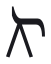

# Symbol Dictionary

_This page is generated from the Sagittal data set; corrections belong in the data, not here._

One row per glyph in the **Sagittal-2 character map** (`sheet/01-characters.csv`, 219 accidental symbols + 8 diacritics). This is the dictionary **v1**: it covers every distinct character in the font. The exhaustive enumeration of *valid symbol combinations* lives in `sheet/02-symbols-valid.csv` (981 rows), of which only ~404 were captured — those additional pure/mixed combinations beyond the character map are **deferred** to a later pass.

Columns: the glyph image (to be added), long (pure) and short sagitypes, [Sagispeak](../concept-explanations/sagispeak.md), [primary comma](primary-commas-table.md) as a directed name (single-shaft only), cents, the frozen [SMuFL](../concept-explanations/comma-names.md) codepoint and class name, and the [apotome complement](../concept-explanations/apotome-complements.md) (the symbol that completes an apotome with this one). Primary-comma names come from `sheet/03`; apotome complements are the symbol at `apotome − cents`. Blank cells mean the datum does not apply (e.g. multi-shaft symbols have no single primary comma).

## Single-shaft symbols

The core comma symbols, each with a primary comma. Sorted by size; negative cents are the downward twins.

| Glyph | Long | Short | Sagispeak | Primary comma | ¢ | SMuFL | Apotome complement |
|---|---|---|---|---|---|---|---|
| <picture><source srcset="../.gitbook/assets/glyphs-dark/accSagittal5v13LargeDiesisDown.png" media="(prefers-color-scheme: dark)"></picture> | `)!//` |  | rachao | 13/5L | -67.291 | U+E3AD accSagittal5v13LargeDiesisDown |  |
| <picture><source srcset="../.gitbook/assets/glyphs-dark/accSagittal35LargeDiesisDown.png" media="(prefers-color-scheme: dark)"></picture> | `(!/` | `d` | dao | 1/35L | -64.915 | U+E30F accSagittal35LargeDiesisDown |  |
| <picture><source srcset="../.gitbook/assets/glyphs-dark/accSagittal11v19LargeDiesisDown.png" media="(prefers-color-scheme: dark)"></picture> | `!//` |  | chao | 11/19L | -63.790 | U+E3AB accSagittal11v19LargeDiesisDown |  |
| <picture><source srcset="../.gitbook/assets/glyphs-dark/accSagittal11LargeDiesisDown.png" media="(prefers-color-scheme: dark)"></picture> | `(!)` | `w` | wao | 11L | -60.412 | U+E30D accSagittal11LargeDiesisDown |  |
| <picture><source srcset="../.gitbook/assets/glyphs-dark/accSagittal49LargeDiesisDown.png" media="(prefers-color-scheme: dark)"></picture> | `!/)` |  | ktao | 1/49L | -59.157 | U+E3A9 accSagittal49LargeDiesisDown |  |
| <picture><source srcset="../.gitbook/assets/glyphs-dark/accSagittal5v49MediumDiesisDown.png" media="(prefers-color-scheme: dark)"></picture> | `)\!/` |  | vrao | 49/5M | -56.482 | U+E3A7 accSagittal5v49MediumDiesisDown |  |
| <picture><source srcset="../.gitbook/assets/glyphs-dark/accSagittal49MediumDiesisDown.png" media="(prefers-color-scheme: dark)"></picture> | `(\!` |  | jpao | 49M | -54.528 | U+E3A5 accSagittal49MediumDiesisDown |  |
| <picture><source srcset="../.gitbook/assets/glyphs-dark/accSagittal11MediumDiesisDown.png" media="(prefers-color-scheme: dark)"></picture> | `\!/` | `v` | vao | 1/11M | -53.273 | U+E30B accSagittal11MediumDiesisDown |  |
| <picture><source srcset="../.gitbook/assets/glyphs-dark/accSagittal11v19MediumDiesisDown.png" media="(prefers-color-scheme: dark)"></picture> | `(!~` |  | jazao | 19/11M | -49.895 | U+E3A3 accSagittal11v19MediumDiesisDown |  |
| <picture><source srcset="../.gitbook/assets/glyphs-dark/accSagittal35MediumDiesisDown.png" media="(prefers-color-scheme: dark)"></picture> | `\!)` | `&` | gao | 35M | -48.770 | U+E309 accSagittal35MediumDiesisDown |  |
| <picture><source srcset="../.gitbook/assets/glyphs-dark/accSagittal5v13MediumDiesisDown.png" media="(prefers-color-scheme: dark)"></picture> | `)\\!` |  | frao | 5/13M | -46.394 | U+E3A1 accSagittal5v13MediumDiesisDown |  |
| <picture><source srcset="../.gitbook/assets/glyphs-dark/accSagittal25SmallDiesisDown.png" media="(prefers-color-scheme: dark)"></picture> | `\\!` | `_` | fao | 25S | -43.013 | U+E307 accSagittal25SmallDiesisDown |  |
| <picture><source srcset="../.gitbook/assets/glyphs-dark/accSagittal23SmallDiesisDown.png" media="(prefers-color-scheme: dark)"></picture> | `~!/` |  | sakao | 1/23S | -40.004 | U+E39F accSagittal23SmallDiesisDown |  |
| <picture><source srcset="../.gitbook/assets/glyphs-dark/accSagittal5v11SmallDiesisDown.png" media="(prefers-color-scheme: dark)"></picture> | `(!(` | `a` | janao | 11/5S | -38.906 | U+E349 accSagittal5v11SmallDiesisDown |  |
| <picture><source srcset="../.gitbook/assets/glyphs-dark/accSagittal5v23SmallDiesisDown.png" media="(prefers-color-scheme: dark)"></picture> | `\!~` |  | pazao | 5/23S | -38.051 | U+E375 accSagittal5v23SmallDiesisDown |  |
| <picture><source srcset="../.gitbook/assets/glyphs-dark/accSagittal49SmallDiesisDown.png" media="(prefers-color-scheme: dark)"></picture> | `~!)` |  | satao | 1/49S | -35.697 | U+E39D accSagittal49SmallDiesisDown |  |
| <picture><source srcset="../.gitbook/assets/glyphs-dark/accSagittal7v11CommaDown.png" media="(prefers-color-scheme: dark)"></picture> | `(!` | `j` | jao | 11/7C | -33.148 | U+E347 accSagittal7v11CommaDown |  |
| <picture><source srcset="../.gitbook/assets/glyphs-dark/accSagittal55CommaDown.png" media="(prefers-color-scheme: dark)"></picture> | `!/` | `k` | kao | 1/55C | -31.767 | U+E345 accSagittal55CommaDown |  |
| <picture><source srcset="../.gitbook/assets/glyphs-dark/accSagittal7v19CommaDown.png" media="(prefers-color-scheme: dark)"></picture> | `)!)` |  | ratao | 7/19C | -30.642 | U+E39B accSagittal7v19CommaDown |  |
| <picture><source srcset="../.gitbook/assets/glyphs-dark/accSagittal7CommaDown.png" media="(prefers-color-scheme: dark)"></picture> | `!)` | `t` | tao | 7C | -27.264 | U+E305 accSagittal7CommaDown |  |
| <picture><source srcset="../.gitbook/assets/glyphs-dark/accSagittal5v19CommaDown.png" media="(prefers-color-scheme: dark)"></picture> | `)\!` |  | prao | 5/19C | -24.884 | U+E373 accSagittal5v19CommaDown |  |
| <picture><source srcset="../.gitbook/assets/glyphs-dark/accSagittal5CommaDown.png" media="(prefers-color-scheme: dark)"></picture> | `\!` | `\` | pao | 5C | -21.506 | U+E303 accSagittal5CommaDown |  |
| <picture><source srcset="../.gitbook/assets/glyphs-dark/accSagittal19CommaDown.png" media="(prefers-color-scheme: dark)"></picture> | `)!~` |  | razao | 19C | -20.082 | U+E399 accSagittal19CommaDown |  |
| <picture><source srcset="../.gitbook/assets/glyphs-dark/accSagittal11v49CommaDown.png" media="(prefers-color-scheme: dark)"></picture> | `~~!` |  | shao | 49/11C | -17.576 | U+E397 accSagittal11v49CommaDown |  |
| <picture><source srcset="../.gitbook/assets/glyphs-dark/accSagittal23CommaDown.png" media="(prefers-color-scheme: dark)"></picture> | `!~` | `z` | zao | 1/23C | -16.544 | U+E371 accSagittal23CommaDown |  |
| <picture><source srcset="../.gitbook/assets/glyphs-dark/accSagittal17CommaDown.png" media="(prefers-color-scheme: dark)"></picture> | `~!(` | `o` | sanao | 1/17C | -14.730 | U+E343 accSagittal17CommaDown |  |
| <picture><source srcset="../.gitbook/assets/glyphs-dark/accSagittal143CommaDown.png" media="(prefers-color-scheme: dark)"></picture> | `)~!` |  | slao | 143C | -12.064 | U+E395 accSagittal143CommaDown |  |
| <picture><source srcset="../.gitbook/assets/glyphs-dark/accSagittal7v11KleismaDown.png" media="(prefers-color-scheme: dark)"></picture> | `)!(` | `i` | ranao | 11/7k | -9.688 | U+E341 accSagittal7v11KleismaDown |  |
| <picture><source srcset="../.gitbook/assets/glyphs-dark/accSagittal17KleismaDown.png" media="(prefers-color-scheme: dark)"></picture> | `~!` | `s` | sao | 17k | -8.730 | U+E393 accSagittal17KleismaDown |  |
| <picture><source srcset="../.gitbook/assets/glyphs-dark/accSagittal5v7KleismaDown.png" media="(prefers-color-scheme: dark)"></picture> | `!(` | `n` | nao | 7/5k | -5.758 | U+E301 accSagittal5v7KleismaDown |  |
| <picture><source srcset="../.gitbook/assets/glyphs-dark/accSagittal19SchismaDown.png" media="(prefers-color-scheme: dark)"></picture> | `)!` | `;` | rao | 1/19s | -3.378 | U+E391 accSagittal19SchismaDown |  |
| <picture><source srcset="../.gitbook/assets/glyphs-dark/accSagittal19SchismaUp.png" media="(prefers-color-scheme: dark)"></picture> | `)|` | `r` | rai | 19s | 3.378 | U+E390 accSagittal19SchismaUp | `(||~` |
| <picture><source srcset="../.gitbook/assets/glyphs-dark/accSagittal5v7KleismaUp.png" media="(prefers-color-scheme: dark)"></picture> | `|(` | `u` | nai | 5/7k | 5.758 | U+E300 accSagittal5v7KleismaUp | `/||)` |
| <picture><source srcset="../.gitbook/assets/glyphs-dark/accSagittal17KleismaUp.png" media="(prefers-color-scheme: dark)"></picture> | `~|` | `$` | sai | 1/17k | 8.730 | U+E392 accSagittal17KleismaUp | `)//||` |
| <picture><source srcset="../.gitbook/assets/glyphs-dark/accSagittal7v11KleismaUp.png" media="(prefers-color-scheme: dark)"></picture> | `)|(` | `*` | ranai | 7/11k | 9.688 | U+E340 accSagittal7v11KleismaUp | `//||` |
| <picture><source srcset="../.gitbook/assets/glyphs-dark/accSagittal143CommaUp.png" media="(prefers-color-scheme: dark)"></picture> | `)~|` |  | slai | 1/143C | 12.064 | U+E394 accSagittal143CommaUp | `~||\` |
| <picture><source srcset="../.gitbook/assets/glyphs-dark/accSagittal17CommaUp.png" media="(prefers-color-scheme: dark)"></picture> | `~|(` | `e` | sanai | 17C | 14.730 | U+E342 accSagittal17CommaUp | `(||(` |
| <picture><source srcset="../.gitbook/assets/glyphs-dark/accSagittal23CommaUp.png" media="(prefers-color-scheme: dark)"></picture> | `|~` | `~` | zai | 23C | 16.544 | U+E370 accSagittal23CommaUp | `/||~` |
| <picture><source srcset="../.gitbook/assets/glyphs-dark/accSagittal11v49CommaUp.png" media="(prefers-color-scheme: dark)"></picture> | `~~|` |  | shai | 11/49C | 17.576 | U+E396 accSagittal11v49CommaUp | `~||)` |
| <picture><source srcset="../.gitbook/assets/glyphs-dark/accSagittal19CommaUp.png" media="(prefers-color-scheme: dark)"></picture> | `)|~` |  | razai | 1/19C | 20.082 | U+E398 accSagittal19CommaUp | `(||` |
| <picture><source srcset="../.gitbook/assets/glyphs-dark/accSagittal5CommaUp.png" media="(prefers-color-scheme: dark)"></picture> | `/|` | `/` | pai | 1/5C | 21.506 | U+E302 accSagittal5CommaUp | `||\` |
| <picture><source srcset="../.gitbook/assets/glyphs-dark/accSagittal5v19CommaUp.png" media="(prefers-color-scheme: dark)"></picture> | `)/|` |  | prai | 19/5C | 24.884 | U+E372 accSagittal5v19CommaUp | `)||)` |
| <picture><source srcset="../.gitbook/assets/glyphs-dark/accSagittal7CommaUp.png" media="(prefers-color-scheme: dark)"></picture> | `|)` | `f` | tai | 1/7C | 27.264 | U+E304 accSagittal7CommaUp | `||)` |
| <picture><source srcset="../.gitbook/assets/glyphs-dark/accSagittal7v19CommaUp.png" media="(prefers-color-scheme: dark)"></picture> | `)|)` |  | ratai | 19/7C | 30.642 | U+E39A accSagittal7v19CommaUp | `)/||` |
| <picture><source srcset="../.gitbook/assets/glyphs-dark/accSagittal55CommaUp.png" media="(prefers-color-scheme: dark)"></picture> | `|\` | `y` | kai | 55C | 31.767 | U+E344 accSagittal55CommaUp | `/||` |
| <picture><source srcset="../.gitbook/assets/glyphs-dark/accSagittal7v11CommaUp.png" media="(prefers-color-scheme: dark)"></picture> | `(|` | `?` | jai | 7/11C | 33.148 | U+E346 accSagittal7v11CommaUp | `)||~` |
| <picture><source srcset="../.gitbook/assets/glyphs-dark/accSagittal49SmallDiesisUp.png" media="(prefers-color-scheme: dark)"></picture> | `~|)` |  | satai | 49S | 35.697 | U+E39C accSagittal49SmallDiesisUp | `~~||` |
| <picture><source srcset="../.gitbook/assets/glyphs-dark/accSagittal5v23SmallDiesisUp.png" media="(prefers-color-scheme: dark)"></picture> | `/|~` |  | pazai | 23/5S | 38.051 | U+E374 accSagittal5v23SmallDiesisUp | `||~` |
| <picture><source srcset="../.gitbook/assets/glyphs-dark/accSagittal5v11SmallDiesisUp.png" media="(prefers-color-scheme: dark)"></picture> | `(|(` | `g` | janai | 5/11S | 38.906 | U+E348 accSagittal5v11SmallDiesisUp | `~||(` |
| <picture><source srcset="../.gitbook/assets/glyphs-dark/accSagittal23SmallDiesisUp.png" media="(prefers-color-scheme: dark)"></picture> | `~|\` |  | sakai | 23S | 40.004 | U+E39E accSagittal23SmallDiesisUp | `)~||` |
| <picture><source srcset="../.gitbook/assets/glyphs-dark/accSagittal25SmallDiesisUp.png" media="(prefers-color-scheme: dark)"></picture> | `//|` | `=` | fai | 1/25S | 43.013 | U+E306 accSagittal25SmallDiesisUp | `)||(` |
| <picture><source srcset="../.gitbook/assets/glyphs-dark/accSagittal5v13MediumDiesisUp.png" media="(prefers-color-scheme: dark)"></picture> | `)//|` |  | frai | 13/5M | 46.394 | U+E3A0 accSagittal5v13MediumDiesisUp | `)|\\` |
| <picture><source srcset="../.gitbook/assets/glyphs-dark/accSagittal35MediumDiesisUp.png" media="(prefers-color-scheme: dark)"></picture> | `/|)` | `%` | gai | 1/35M | 48.770 | U+E308 accSagittal35MediumDiesisUp | `(|\` |
| <picture><source srcset="../.gitbook/assets/glyphs-dark/accSagittal11v19MediumDiesisUp.png" media="(prefers-color-scheme: dark)"></picture> | `(|~` |  | jazai | 11/19M | 49.895 | U+E3A2 accSagittal11v19MediumDiesisUp | `|\\` |
| <picture><source srcset="../.gitbook/assets/glyphs-dark/accSagittal11MediumDiesisUp.png" media="(prefers-color-scheme: dark)"></picture> | `/|\` | `^` | vai | 11M | 53.273 | U+E30A accSagittal11MediumDiesisUp | `(|)` |
| <picture><source srcset="../.gitbook/assets/glyphs-dark/accSagittal49MediumDiesisUp.png" media="(prefers-color-scheme: dark)"></picture> | `(/|` |  | jpai | 1/49M | 54.528 | U+E3A4 accSagittal49MediumDiesisUp | `|\)` |
| <picture><source srcset="../.gitbook/assets/glyphs-dark/accSagittal5v49MediumDiesisUp.png" media="(prefers-color-scheme: dark)"></picture> | `)/|\` |  | vrai | 5/49M | 56.482 | U+E3A6 accSagittal5v49MediumDiesisUp |  |
| <picture><source srcset="../.gitbook/assets/glyphs-dark/accSagittal49LargeDiesisUp.png" media="(prefers-color-scheme: dark)"></picture> | `|\)` |  | ktai | 49L | 59.157 | U+E3A8 accSagittal49LargeDiesisUp | `(/|` |
| <picture><source srcset="../.gitbook/assets/glyphs-dark/accSagittal11LargeDiesisUp.png" media="(prefers-color-scheme: dark)"></picture> | `(|)` | `m` | wai | 1/11L | 60.412 | U+E30C accSagittal11LargeDiesisUp | `/|\` |
| <picture><source srcset="../.gitbook/assets/glyphs-dark/accSagittal11v19LargeDiesisUp.png" media="(prefers-color-scheme: dark)"></picture> | `|\\` |  | chai | 19/11L | 63.790 | U+E3AA accSagittal11v19LargeDiesisUp | `(|~` |
| <picture><source srcset="../.gitbook/assets/glyphs-dark/accSagittal35LargeDiesisUp.png" media="(prefers-color-scheme: dark)"></picture> | `(|\` | `q` | dai | 35L | 64.915 | U+E30E accSagittal35LargeDiesisUp | `/|)` |
| <picture><source srcset="../.gitbook/assets/glyphs-dark/accSagittal5v13LargeDiesisUp.png" media="(prefers-color-scheme: dark)"></picture> | `)|\\` |  | rachai | 5/13L | 67.291 | U+E3AC accSagittal5v13LargeDiesisUp | `)//|` |

## Multi-shaft symbols

Two-, three- and four-shaft symbols (Revo) and the Evo compounds, Spartan and Athenian sets first. These carry a sharp/flat’s worth of apotomes plus a comma, so they have no single primary comma; Sagispeak is the composed form (e.g. `kaisharp`).

| Glyph | Long | Short | Sagispeak | Primary comma | ¢ | SMuFL | Apotome complement |
|---|---|---|---|---|---|---|---|
| <picture><source srcset="../.gitbook/assets/glyphs-dark/accSagittalFlat.png" media="(prefers-color-scheme: dark)"></picture> | `\!!/` | `b` | flat |  | -113.685 | U+E319 accSagittalFlat |  |
| <picture><source srcset="../.gitbook/assets/glyphs-dark/accSagittalFlat5v7kUp.png" media="(prefers-color-scheme: dark)"></picture> | `\!!)` | `ub` | naiflat |  | -107.927 | U+E317 accSagittalFlat5v7kUp |  |
| <picture><source srcset="../.gitbook/assets/glyphs-dark/accSagittalFlat5CUp.png" media="(prefers-color-scheme: dark)"></picture> | `!!/` | `/b` | paiflat |  | -92.179 | U+E315 accSagittalFlat5CUp |  |
| <picture><source srcset="../.gitbook/assets/glyphs-dark/accSagittalFlat7CUp.png" media="(prefers-color-scheme: dark)"></picture> | `!!)` | `fb` | taiflat |  | -86.421 | U+E313 accSagittalFlat7CUp |  |
| <picture><source srcset="../.gitbook/assets/glyphs-dark/accSagittalFlat25SUp.png" media="(prefers-color-scheme: dark)"></picture> | `)!!(` | `=b` | faiflat |  | -70.672 | U+E311 accSagittalFlat25SUp |  |
| <picture><source srcset="../.gitbook/assets/glyphs-dark/accSagittalSharp25SDown.png" media="(prefers-color-scheme: dark)"></picture> | `)||(` | `_#` | faosharp |  | 70.672 | U+E310 accSagittalSharp25SDown | `//|` |
| <picture><source srcset="../.gitbook/assets/glyphs-dark/accSagittalSharp7CDown.png" media="(prefers-color-scheme: dark)"></picture> | `||)` | `t#` | taosharp |  | 86.421 | U+E312 accSagittalSharp7CDown | `|)` |
| <picture><source srcset="../.gitbook/assets/glyphs-dark/accSagittalSharp5CDown.png" media="(prefers-color-scheme: dark)"></picture> | `||\` | `\#` | paosharp |  | 92.179 | U+E314 accSagittalSharp5CDown | `/|` |
| <picture><source srcset="../.gitbook/assets/glyphs-dark/accSagittalSharp5v7kDown.png" media="(prefers-color-scheme: dark)"></picture> | `/||)` | `n#` | naosharp |  | 107.927 | U+E316 accSagittalSharp5v7kDown | `|(` |
| <picture><source srcset="../.gitbook/assets/glyphs-dark/accSagittalSharp.png" media="(prefers-color-scheme: dark)"></picture> | `/||\` | `#` | sharp |  | 113.685 | U+E318 accSagittalSharp | `|//|` |
| <picture><source srcset="../.gitbook/assets/glyphs-dark/accSagittalFlat35LDown.png" media="(prefers-color-scheme: dark)"></picture> | `(!!!/` | `db` | daoflat |  | -178.600 | U+E32B accSagittalFlat35LDown |  |
| <picture><source srcset="../.gitbook/assets/glyphs-dark/accSagittalFlat11LDown.png" media="(prefers-color-scheme: dark)"></picture> | `(!!!)` | `wb` | waoflat |  | -174.097 | U+E329 accSagittalFlat11LDown |  |
| <picture><source srcset="../.gitbook/assets/glyphs-dark/accSagittalFlat11MDown.png" media="(prefers-color-scheme: dark)"></picture> | `\!!!/` | `vb` | vaoflat |  | -166.958 | U+E327 accSagittalFlat11MDown |  |
| <picture><source srcset="../.gitbook/assets/glyphs-dark/accSagittalFlat35MDown.png" media="(prefers-color-scheme: dark)"></picture> | `\!!!)` | `&b` | gaoflat |  | -162.455 | U+E325 accSagittalFlat35MDown |  |
| <picture><source srcset="../.gitbook/assets/glyphs-dark/accSagittalFlat25SDown.png" media="(prefers-color-scheme: dark)"></picture> | `\\!!!` | `_b` | faoflat |  | -156.698 | U+E323 accSagittalFlat25SDown |  |
| <picture><source srcset="../.gitbook/assets/glyphs-dark/accSagittalFlat7CDown.png" media="(prefers-color-scheme: dark)"></picture> | `!!!)` | `tb` | taoflat |  | -140.949 | U+E321 accSagittalFlat7CDown |  |
| <picture><source srcset="../.gitbook/assets/glyphs-dark/accSagittalFlat5CDown.png" media="(prefers-color-scheme: dark)"></picture> | `\!!!` | `\b` | paoflat |  | -135.191 | U+E31F accSagittalFlat5CDown |  |
| <picture><source srcset="../.gitbook/assets/glyphs-dark/accSagittalFlat5v7kDown.png" media="(prefers-color-scheme: dark)"></picture> | `!!!(` | `nb` | naoflat |  | -119.443 | U+E31D accSagittalFlat5v7kDown |  |
| <picture><source srcset="../.gitbook/assets/glyphs-dark/accSagittalSharp5v7kUp.png" media="(prefers-color-scheme: dark)"></picture> | `|||(` | `u#` | naisharp |  | 119.443 | U+E31C accSagittalSharp5v7kUp |  |
| <picture><source srcset="../.gitbook/assets/glyphs-dark/accSagittalSharp5CUp.png" media="(prefers-color-scheme: dark)"></picture> | `/|||` | `/#` | paisharp |  | 135.191 | U+E31E accSagittalSharp5CUp |  |
| <picture><source srcset="../.gitbook/assets/glyphs-dark/accSagittalSharp7CUp.png" media="(prefers-color-scheme: dark)"></picture> | `|||)` | `f#` | taisharp |  | 140.949 | U+E320 accSagittalSharp7CUp |  |
| <picture><source srcset="../.gitbook/assets/glyphs-dark/accSagittalSharp25SUp.png" media="(prefers-color-scheme: dark)"></picture> | `//|||` | `=#` | faisharp |  | 156.698 | U+E322 accSagittalSharp25SUp |  |
| <picture><source srcset="../.gitbook/assets/glyphs-dark/accSagittalSharp35MUp.png" media="(prefers-color-scheme: dark)"></picture> | `/|||)` | `%#` | gaisharp |  | 162.455 | U+E324 accSagittalSharp35MUp |  |
| <picture><source srcset="../.gitbook/assets/glyphs-dark/accSagittalSharp11MUp.png" media="(prefers-color-scheme: dark)"></picture> | `/|||\` | `^#` | vaisharp |  | 166.958 | U+E326 accSagittalSharp11MUp |  |
| <picture><source srcset="../.gitbook/assets/glyphs-dark/accSagittalSharp11LUp.png" media="(prefers-color-scheme: dark)"></picture> | `(|||)` | `m#` | waisharp |  | 174.097 | U+E328 accSagittalSharp11LUp |  |
| <picture><source srcset="../.gitbook/assets/glyphs-dark/accSagittalSharp35LUp.png" media="(prefers-color-scheme: dark)"></picture> | `(|||\` | `q#` | daisharp |  | 178.600 | U+E32A accSagittalSharp35LUp |  |
| <picture><source srcset="../.gitbook/assets/glyphs-dark/accSagittalDoubleFlat.png" media="(prefers-color-scheme: dark)"></picture> | `\Y/` | `bb` | doubleflat |  | -227.370 | U+E335 accSagittalDoubleFlat |  |
| <picture><source srcset="../.gitbook/assets/glyphs-dark/accSagittalDoubleFlat5v7kUp.png" media="(prefers-color-scheme: dark)"></picture> | `\Y)` | `ubb` | naidoubleflat |  | -221.612 | U+E333 accSagittalDoubleFlat5v7kUp |  |
| <picture><source srcset="../.gitbook/assets/glyphs-dark/accSagittalDoubleFlat5CUp.png" media="(prefers-color-scheme: dark)"></picture> | `Y/` | `/bb` | paidoubleflat |  | -205.864 | U+E331 accSagittalDoubleFlat5CUp |  |
| <picture><source srcset="../.gitbook/assets/glyphs-dark/accSagittalDoubleFlat7CUp.png" media="(prefers-color-scheme: dark)"></picture> | `Y)` | `fbb` | taidoubleflat |  | -200.106 | U+E32F accSagittalDoubleFlat7CUp |  |
| <picture><source srcset="../.gitbook/assets/glyphs-dark/accSagittalDoubleFlat25SUp.png" media="(prefers-color-scheme: dark)"></picture> | `)Y(` | `=bb` | faidoubleflat |  | -184.357 | U+E32D accSagittalDoubleFlat25SUp |  |
| <picture><source srcset="../.gitbook/assets/glyphs-dark/accSagittalDoubleSharp25SDown.png" media="(prefers-color-scheme: dark)"></picture> | `)X(` | `_x` | faodoublesharp |  | 184.357 | U+E32C accSagittalDoubleSharp25SDown |  |
| <picture><source srcset="../.gitbook/assets/glyphs-dark/accSagittalDoubleSharp7CDown.png" media="(prefers-color-scheme: dark)"></picture> | `X)` | `tx` | taodoublesharp |  | 200.106 | U+E32E accSagittalDoubleSharp7CDown |  |
| <picture><source srcset="../.gitbook/assets/glyphs-dark/accSagittalDoubleSharp5CDown.png" media="(prefers-color-scheme: dark)"></picture> | `X\` | `\x` | paodoublesharp |  | 205.864 | U+E330 accSagittalDoubleSharp5CDown |  |
| <picture><source srcset="../.gitbook/assets/glyphs-dark/accSagittalDoubleSharp5v7kDown.png" media="(prefers-color-scheme: dark)"></picture> | `/X)` | `nx` | naodoublesharp |  | 221.612 | U+E332 accSagittalDoubleSharp5v7kDown |  |
| <picture><source srcset="../.gitbook/assets/glyphs-dark/accSagittalDoubleSharp.png" media="(prefers-color-scheme: dark)"></picture> | `/X\` | `x` | doublesharp |  | 227.370 | U+E334 accSagittalDoubleSharp |  |
| <picture><source srcset="../.gitbook/assets/glyphs-dark/accSagittalFlat7v11kUp.png" media="(prefers-color-scheme: dark)"></picture> | `\\!!` | `*b` | ranaiflat |  | -103.997 | U+E353 accSagittalFlat7v11kUp |  |
| <picture><source srcset="../.gitbook/assets/glyphs-dark/accSagittalFlat17CUp.png" media="(prefers-color-scheme: dark)"></picture> | `(!!(` | `eb` | sanaiflat |  | -98.955 | U+E351 accSagittalFlat17CUp |  |
| <picture><source srcset="../.gitbook/assets/glyphs-dark/accSagittalFlat55CUp.png" media="(prefers-color-scheme: dark)"></picture> | `\!!` | `yb` | kaiflat |  | -81.918 | U+E34F accSagittalFlat55CUp |  |
| <picture><source srcset="../.gitbook/assets/glyphs-dark/accSagittalFlat7v11CUp.png" media="(prefers-color-scheme: dark)"></picture> | `)!!~` | `?b` | jaiflat |  | -80.537 | U+E34D accSagittalFlat7v11CUp |  |
| <picture><source srcset="../.gitbook/assets/glyphs-dark/accSagittalFlat5v11SUp.png" media="(prefers-color-scheme: dark)"></picture> | `~!!(` | `gb` | janaiflat |  | -74.779 | U+E34B accSagittalFlat5v11SUp |  |
| <picture><source srcset="../.gitbook/assets/glyphs-dark/accSagittalSharp5v11SDown.png" media="(prefers-color-scheme: dark)"></picture> | `~||(` | `a#` | janaosharp |  | 74.779 | U+E34A accSagittalSharp5v11SDown | `(|(` |
| <picture><source srcset="../.gitbook/assets/glyphs-dark/accSagittalSharp7v11CDown.png" media="(prefers-color-scheme: dark)"></picture> | `)||~` | `j#` | jaosharp |  | 80.537 | U+E34C accSagittalSharp7v11CDown | `(|` |
| <picture><source srcset="../.gitbook/assets/glyphs-dark/accSagittalSharp55CDown.png" media="(prefers-color-scheme: dark)"></picture> | `/||` | `k#` | kaosharp |  | 81.918 | U+E34E accSagittalSharp55CDown | `|\` |
| <picture><source srcset="../.gitbook/assets/glyphs-dark/accSagittalSharp17CDown.png" media="(prefers-color-scheme: dark)"></picture> | `(||(` | `o#` | sanaosharp |  | 98.955 | U+E350 accSagittalSharp17CDown | `~|(` |
| <picture><source srcset="../.gitbook/assets/glyphs-dark/accSagittalSharp7v11kDown.png" media="(prefers-color-scheme: dark)"></picture> | `//||` | `i#` | ranaosharp |  | 103.997 | U+E352 accSagittalSharp7v11kDown | `)|(` |
| <picture><source srcset="../.gitbook/assets/glyphs-dark/accSagittalFlat5v11SDown.png" media="(prefers-color-scheme: dark)"></picture> | `(!!!(` | `ab` | janaoflat |  | -152.591 | U+E35D accSagittalFlat5v11SDown |  |
| <picture><source srcset="../.gitbook/assets/glyphs-dark/accSagittalFlat7v11CDown.png" media="(prefers-color-scheme: dark)"></picture> | `(!!!` | `jb` | jaoflat |  | -146.833 | U+E35B accSagittalFlat7v11CDown |  |
| <picture><source srcset="../.gitbook/assets/glyphs-dark/accSagittalFlat55CDown.png" media="(prefers-color-scheme: dark)"></picture> | `!!!/` | `kb` | kaoflat |  | -145.452 | U+E359 accSagittalFlat55CDown |  |
| <picture><source srcset="../.gitbook/assets/glyphs-dark/accSagittalFlat17CDown.png" media="(prefers-color-scheme: dark)"></picture> | `~!!!(` | `ob` | sanaoflat |  | -128.415 | U+E357 accSagittalFlat17CDown |  |
| <picture><source srcset="../.gitbook/assets/glyphs-dark/accSagittalFlat7v11kDown.png" media="(prefers-color-scheme: dark)"></picture> | `)!!!(` | `ib` | ranaoflat |  | -123.373 | U+E355 accSagittalFlat7v11kDown |  |
| <picture><source srcset="../.gitbook/assets/glyphs-dark/accSagittalSharp7v11kUp.png" media="(prefers-color-scheme: dark)"></picture> | `)|||(` | `*#` | ranaisharp |  | 123.373 | U+E354 accSagittalSharp7v11kUp |  |
| <picture><source srcset="../.gitbook/assets/glyphs-dark/accSagittalSharp17CUp.png" media="(prefers-color-scheme: dark)"></picture> | `~|||(` | `e#` | sanaisharp |  | 128.415 | U+E356 accSagittalSharp17CUp |  |
| <picture><source srcset="../.gitbook/assets/glyphs-dark/accSagittalSharp55CUp.png" media="(prefers-color-scheme: dark)"></picture> | `|||\` | `y#` | kaisharp |  | 145.452 | U+E358 accSagittalSharp55CUp |  |
| <picture><source srcset="../.gitbook/assets/glyphs-dark/accSagittalSharp7v11CUp.png" media="(prefers-color-scheme: dark)"></picture> | `(|||` | `?#` | jaisharp |  | 146.833 | U+E35A accSagittalSharp7v11CUp |  |
| <picture><source srcset="../.gitbook/assets/glyphs-dark/accSagittalSharp5v11SUp.png" media="(prefers-color-scheme: dark)"></picture> | `(|||(` | `g#` | janaisharp |  | 152.591 | U+E35C accSagittalSharp5v11SUp |  |
| <picture><source srcset="../.gitbook/assets/glyphs-dark/accSagittalDoubleFlat7v11kUp.png" media="(prefers-color-scheme: dark)"></picture> | `\\Y` | `*bb` | ranaidoubleflat |  | -217.682 | U+E367 accSagittalDoubleFlat7v11kUp |  |
| <picture><source srcset="../.gitbook/assets/glyphs-dark/accSagittalDoubleFlat17CUp.png" media="(prefers-color-scheme: dark)"></picture> | `(Y(` | `ebb` | sanaidoubleflat |  | -212.640 | U+E365 accSagittalDoubleFlat17CUp |  |
| <picture><source srcset="../.gitbook/assets/glyphs-dark/accSagittalDoubleFlat55CUp.png" media="(prefers-color-scheme: dark)"></picture> | `\Y` | `ybb` | kaidoubleflat |  | -195.603 | U+E363 accSagittalDoubleFlat55CUp |  |
| <picture><source srcset="../.gitbook/assets/glyphs-dark/accSagittalDoubleFlat7v11CUp.png" media="(prefers-color-scheme: dark)"></picture> | `)Y~` | `?bb` | jaidoubleflat |  | -194.222 | U+E361 accSagittalDoubleFlat7v11CUp |  |
| <picture><source srcset="../.gitbook/assets/glyphs-dark/accSagittalDoubleFlat5v11SUp.png" media="(prefers-color-scheme: dark)"></picture> | `~Y(` | `gbb` | janaidoubleflat |  | -188.464 | U+E35F accSagittalDoubleFlat5v11SUp |  |
| <picture><source srcset="../.gitbook/assets/glyphs-dark/accSagittalDoubleSharp5v11SDown.png" media="(prefers-color-scheme: dark)"></picture> | `~X(` | `ax` | janaodoublesharp |  | 188.464 | U+E35E accSagittalDoubleSharp5v11SDown |  |
| <picture><source srcset="../.gitbook/assets/glyphs-dark/accSagittalDoubleSharp7v11CDown.png" media="(prefers-color-scheme: dark)"></picture> | `)X~` | `jx` | jaodoublesharp |  | 194.222 | U+E360 accSagittalDoubleSharp7v11CDown |  |
| <picture><source srcset="../.gitbook/assets/glyphs-dark/accSagittalDoubleSharp55CDown.png" media="(prefers-color-scheme: dark)"></picture> | `/X` | `kx` | kaodoublesharp |  | 195.603 | U+E362 accSagittalDoubleSharp55CDown |  |
| <picture><source srcset="../.gitbook/assets/glyphs-dark/accSagittalDoubleSharp17CDown.png" media="(prefers-color-scheme: dark)"></picture> | `(X(` | `ox` | sanaodoublesharp |  | 212.640 | U+E364 accSagittalDoubleSharp17CDown |  |
| <picture><source srcset="../.gitbook/assets/glyphs-dark/accSagittalDoubleSharp7v11kDown.png" media="(prefers-color-scheme: dark)"></picture> | `//X` | `ix` | ranaodoublesharp |  | 217.682 | U+E366 accSagittalDoubleSharp7v11kDown |  |
| <picture><source srcset="../.gitbook/assets/glyphs-dark/accSagittalFlat19sUp.png" media="(prefers-color-scheme: dark)"></picture> | `(!!~` | `rb` | raiflat |  | -110.307 | U+E3BF accSagittalFlat19sUp |  |
| <picture><source srcset="../.gitbook/assets/glyphs-dark/accSagittalFlat17kUp.png" media="(prefers-color-scheme: dark)"></picture> | `)\\!!` | `$b` | saiflat |  | -104.955 | U+E3BD accSagittalFlat17kUp |  |
| <picture><source srcset="../.gitbook/assets/glyphs-dark/accSagittalFlat143CUp.png" media="(prefers-color-scheme: dark)"></picture> | `~!!/` |  | slaiflat |  | -101.621 | U+E3BB accSagittalFlat143CUp |  |
| <picture><source srcset="../.gitbook/assets/glyphs-dark/accSagittalFlat11v49CUp.png" media="(prefers-color-scheme: dark)"></picture> | `~!!)` |  | shaiflat |  | -96.109 | U+E3B9 accSagittalFlat11v49CUp |  |
| <picture><source srcset="../.gitbook/assets/glyphs-dark/accSagittalFlat19CUp.png" media="(prefers-color-scheme: dark)"></picture> | `(!!` |  | razaiflat |  | -93.603 | U+E3B7 accSagittalFlat19CUp |  |
| <picture><source srcset="../.gitbook/assets/glyphs-dark/accSagittalFlat7v19CUp.png" media="(prefers-color-scheme: dark)"></picture> | `)\!!` |  | rataiflat |  | -83.043 | U+E3B5 accSagittalFlat7v19CUp |  |
| <picture><source srcset="../.gitbook/assets/glyphs-dark/accSagittalFlat49SUp.png" media="(prefers-color-scheme: dark)"></picture> | `~~!!` |  | sataiflat |  | -77.988 | U+E3B3 accSagittalFlat49SUp |  |
| <picture><source srcset="../.gitbook/assets/glyphs-dark/accSagittalFlat23SUp.png" media="(prefers-color-scheme: dark)"></picture> | `)~!!` |  | sakaiflat |  | -73.681 | U+E3B1 accSagittalFlat23SUp |  |
| <picture><source srcset="../.gitbook/assets/glyphs-dark/accSagittalSharp23SDown.png" media="(prefers-color-scheme: dark)"></picture> | `)~||` |  | sakaosharp |  | 73.681 | U+E3B0 accSagittalSharp23SDown | `~|\` |
| <picture><source srcset="../.gitbook/assets/glyphs-dark/accSagittalSharp49SDown.png" media="(prefers-color-scheme: dark)"></picture> | `~~||` |  | sataosharp |  | 77.988 | U+E3B2 accSagittalSharp49SDown | `~|)` |
| <picture><source srcset="../.gitbook/assets/glyphs-dark/accSagittalSharp7v19CDown.png" media="(prefers-color-scheme: dark)"></picture> | `)/||` |  | rataosharp |  | 83.043 | U+E3B4 accSagittalSharp7v19CDown | `)|)` |
| <picture><source srcset="../.gitbook/assets/glyphs-dark/accSagittalSharp19CDown.png" media="(prefers-color-scheme: dark)"></picture> | `(||` |  | razaosharp |  | 93.603 | U+E3B6 accSagittalSharp19CDown | `)|~` |
| <picture><source srcset="../.gitbook/assets/glyphs-dark/accSagittalSharp11v49CDown.png" media="(prefers-color-scheme: dark)"></picture> | `~||)` |  | shaosharp |  | 96.109 | U+E3B8 accSagittalSharp11v49CDown | `~~|` |
| <picture><source srcset="../.gitbook/assets/glyphs-dark/accSagittalSharp143CDown.png" media="(prefers-color-scheme: dark)"></picture> | `~||\` |  | slaosharp |  | 101.621 | U+E3BA accSagittalSharp143CDown | `)~|` |
| <picture><source srcset="../.gitbook/assets/glyphs-dark/accSagittalSharp17kDown.png" media="(prefers-color-scheme: dark)"></picture> | `)//||` | `s#` | saosharp |  | 104.955 | U+E3BC accSagittalSharp17kDown | `~|` |
| <picture><source srcset="../.gitbook/assets/glyphs-dark/accSagittalSharp19sDown.png" media="(prefers-color-scheme: dark)"></picture> | `(||~` | `;#` | raosharp |  | 110.307 | U+E3BE accSagittalSharp19sDown | `)|` |
| <picture><source srcset="../.gitbook/assets/glyphs-dark/accSagittalFlat5v13LDown.png" media="(prefers-color-scheme: dark)"></picture> | `)!!!//` |  | rachaoflat |  | -180.976 | U+E3DD accSagittalFlat5v13LDown |  |
| <picture><source srcset="../.gitbook/assets/glyphs-dark/accSagittalFlat11v19LDown.png" media="(prefers-color-scheme: dark)"></picture> | `!!!//` |  | chaoflat |  | -177.475 | U+E3DB accSagittalFlat11v19LDown |  |
| <picture><source srcset="../.gitbook/assets/glyphs-dark/accSagittalFlat49LDown.png" media="(prefers-color-scheme: dark)"></picture> | `!!!/)` |  | ktaoflat |  | -172.842 | U+E3D9 accSagittalFlat49LDown |  |
| <picture><source srcset="../.gitbook/assets/glyphs-dark/accSagittalFlat5v49MDown.png" media="(prefers-color-scheme: dark)"></picture> | `)\!!!/` |  | vraoflat |  | -170.167 | U+E3D7 accSagittalFlat5v49MDown |  |
| <picture><source srcset="../.gitbook/assets/glyphs-dark/accSagittalFlat49MDown.png" media="(prefers-color-scheme: dark)"></picture> | `(\!!!` |  | jpaoflat |  | -168.213 | U+E3D5 accSagittalFlat49MDown |  |
| <picture><source srcset="../.gitbook/assets/glyphs-dark/accSagittalFlat11v19MDown.png" media="(prefers-color-scheme: dark)"></picture> | `(!!!~` |  | jazaoflat |  | -163.580 | U+E3D3 accSagittalFlat11v19MDown |  |
| <picture><source srcset="../.gitbook/assets/glyphs-dark/accSagittalFlat5v13MDown.png" media="(prefers-color-scheme: dark)"></picture> | `)\\!!!` |  | fraoflat |  | -160.079 | U+E3D1 accSagittalFlat5v13MDown |  |
| <picture><source srcset="../.gitbook/assets/glyphs-dark/accSagittalFlat23SDown.png" media="(prefers-color-scheme: dark)"></picture> | `~!!!/` |  | sakaoflat |  | -153.689 | U+E3CF accSagittalFlat23SDown |  |
| <picture><source srcset="../.gitbook/assets/glyphs-dark/accSagittalFlat49SDown.png" media="(prefers-color-scheme: dark)"></picture> | `~!!!)` |  | sataoflat |  | -149.382 | U+E3CD accSagittalFlat49SDown |  |
| <picture><source srcset="../.gitbook/assets/glyphs-dark/accSagittalFlat7v19CDown.png" media="(prefers-color-scheme: dark)"></picture> | `)!!!)` |  | rataoflat |  | -144.327 | U+E3CB accSagittalFlat7v19CDown |  |
| <picture><source srcset="../.gitbook/assets/glyphs-dark/accSagittalFlat19CDown.png" media="(prefers-color-scheme: dark)"></picture> | `)!!!~` |  | razaoflat |  | -133.767 | U+E3C9 accSagittalFlat19CDown |  |
| <picture><source srcset="../.gitbook/assets/glyphs-dark/accSagittalFlat11v49CDown.png" media="(prefers-color-scheme: dark)"></picture> | `~~!!!` |  | shaoflat |  | -131.261 | U+E3C7 accSagittalFlat11v49CDown |  |
| <picture><source srcset="../.gitbook/assets/glyphs-dark/accSagittalFlat143CDown.png" media="(prefers-color-scheme: dark)"></picture> | `)~!!!` |  | slaoflat |  | -125.749 | U+E3C5 accSagittalFlat143CDown |  |
| <picture><source srcset="../.gitbook/assets/glyphs-dark/accSagittalFlat17kDown.png" media="(prefers-color-scheme: dark)"></picture> | `~!!!` | `sb` | saoflat |  | -122.415 | U+E3C3 accSagittalFlat17kDown |  |
| <picture><source srcset="../.gitbook/assets/glyphs-dark/accSagittalFlat19sDown.png" media="(prefers-color-scheme: dark)"></picture> | `)!!!` | `;b` | raoflat |  | -117.063 | U+E3C1 accSagittalFlat19sDown |  |
| <picture><source srcset="../.gitbook/assets/glyphs-dark/accSagittalSharp19sUp.png" media="(prefers-color-scheme: dark)"></picture> | `)|||` | `r#` | raisharp |  | 117.063 | U+E3C0 accSagittalSharp19sUp |  |
| <picture><source srcset="../.gitbook/assets/glyphs-dark/accSagittalSharp17kUp.png" media="(prefers-color-scheme: dark)"></picture> | `~|||` | `$#` | saisharp |  | 122.415 | U+E3C2 accSagittalSharp17kUp |  |
| <picture><source srcset="../.gitbook/assets/glyphs-dark/accSagittalSharp143CUp.png" media="(prefers-color-scheme: dark)"></picture> | `)~|||` |  | slaisharp |  | 125.749 | U+E3C4 accSagittalSharp143CUp |  |
| <picture><source srcset="../.gitbook/assets/glyphs-dark/accSagittalSharp11v49CUp.png" media="(prefers-color-scheme: dark)"></picture> | `~~|||` |  | shaisharp |  | 131.261 | U+E3C6 accSagittalSharp11v49CUp |  |
| <picture><source srcset="../.gitbook/assets/glyphs-dark/accSagittalSharp19CUp.png" media="(prefers-color-scheme: dark)"></picture> | `)|||~` |  | razaisharp |  | 133.767 | U+E3C8 accSagittalSharp19CUp |  |
| <picture><source srcset="../.gitbook/assets/glyphs-dark/accSagittalSharp7v19CUp.png" media="(prefers-color-scheme: dark)"></picture> | `)|||)` |  | rataisharp |  | 144.327 | U+E3CA accSagittalSharp7v19CUp |  |
| <picture><source srcset="../.gitbook/assets/glyphs-dark/accSagittalSharp49SUp.png" media="(prefers-color-scheme: dark)"></picture> | `~|||)` |  | sataisharp |  | 149.382 | U+E3CC accSagittalSharp49SUp |  |
| <picture><source srcset="../.gitbook/assets/glyphs-dark/accSagittalSharp23SUp.png" media="(prefers-color-scheme: dark)"></picture> | `~|||\` |  | sakaisharp |  | 153.689 | U+E3CE accSagittalSharp23SUp |  |
| <picture><source srcset="../.gitbook/assets/glyphs-dark/accSagittalSharp5v13MUp.png" media="(prefers-color-scheme: dark)"></picture> | `)//|||` |  | fraisharp |  | 160.079 | U+E3D0 accSagittalSharp5v13MUp |  |
| <picture><source srcset="../.gitbook/assets/glyphs-dark/accSagittalSharp11v19MUp.png" media="(prefers-color-scheme: dark)"></picture> | `(|||~` |  | jazaisharp |  | 163.580 | U+E3D2 accSagittalSharp11v19MUp |  |
| <picture><source srcset="../.gitbook/assets/glyphs-dark/accSagittalSharp49MUp.png" media="(prefers-color-scheme: dark)"></picture> | `(/|||` |  | jpaisharp |  | 168.213 | U+E3D4 accSagittalSharp49MUp |  |
| <picture><source srcset="../.gitbook/assets/glyphs-dark/accSagittalSharp5v49MUp.png" media="(prefers-color-scheme: dark)"></picture> | `)/|||\` |  | vraisharp |  | 170.167 | U+E3D6 accSagittalSharp5v49MUp |  |
| <picture><source srcset="../.gitbook/assets/glyphs-dark/accSagittalSharp49LUp.png" media="(prefers-color-scheme: dark)"></picture> | `|||\)` |  | ktaisharp |  | 172.842 | U+E3D8 accSagittalSharp49LUp |  |
| <picture><source srcset="../.gitbook/assets/glyphs-dark/accSagittalSharp11v19LUp.png" media="(prefers-color-scheme: dark)"></picture> | `|||\\` |  | chaisharp |  | 177.475 | U+E3DA accSagittalSharp11v19LUp |  |
| <picture><source srcset="../.gitbook/assets/glyphs-dark/accSagittalSharp5v13LUp.png" media="(prefers-color-scheme: dark)"></picture> | `)|||\\` |  | rachaisharp |  | 180.976 | U+E3DC accSagittalSharp5v13LUp |  |
| <picture><source srcset="../.gitbook/assets/glyphs-dark/accSagittalDoubleFlat19sUp.png" media="(prefers-color-scheme: dark)"></picture> | `(Y~` | `rbb` | raidoubleflat |  | -223.992 | U+E3EF accSagittalDoubleFlat19sUp |  |
| <picture><source srcset="../.gitbook/assets/glyphs-dark/accSagittalDoubleFlat17kUp.png" media="(prefers-color-scheme: dark)"></picture> | `)\\Y` | `$bb` | saidoubleflat |  | -218.640 | U+E3ED accSagittalDoubleFlat17kUp |  |
| <picture><source srcset="../.gitbook/assets/glyphs-dark/accSagittalDoubleFlat143CUp.png" media="(prefers-color-scheme: dark)"></picture> | `~Y/` |  | slaidoubleflat |  | -215.306 | U+E3EB accSagittalDoubleFlat143CUp |  |
| <picture><source srcset="../.gitbook/assets/glyphs-dark/accSagittalDoubleFlat11v49CUp.png" media="(prefers-color-scheme: dark)"></picture> | `~Y)` |  | shaidoubleflat |  | -209.794 | U+E3E9 accSagittalDoubleFlat11v49CUp |  |
| <picture><source srcset="../.gitbook/assets/glyphs-dark/accSagittalDoubleFlat19CUp.png" media="(prefers-color-scheme: dark)"></picture> | `(Y` |  | razaidoubleflat |  | -207.288 | U+E3E7 accSagittalDoubleFlat19CUp |  |
| <picture><source srcset="../.gitbook/assets/glyphs-dark/accSagittalDoubleFlat7v19CUp.png" media="(prefers-color-scheme: dark)"></picture> | `)\Y` |  | rataidoubleflat |  | -196.728 | U+E3E5 accSagittalDoubleFlat7v19CUp |  |
| <picture><source srcset="../.gitbook/assets/glyphs-dark/accSagittalDoubleFlat49SUp.png" media="(prefers-color-scheme: dark)"></picture> | `~~Y` |  | sataidoubleflat |  | -191.673 | U+E3E3 accSagittalDoubleFlat49SUp |  |
| <picture><source srcset="../.gitbook/assets/glyphs-dark/accSagittalDoubleFlat23SUp.png" media="(prefers-color-scheme: dark)"></picture> | `)~Y` |  | sakaidoubleflat |  | -187.366 | U+E3E1 accSagittalDoubleFlat23SUp |  |
| <picture><source srcset="../.gitbook/assets/glyphs-dark/accSagittalDoubleSharp23SDown.png" media="(prefers-color-scheme: dark)"></picture> | `)~X` |  | sakaodoublesharp |  | 187.366 | U+E3E0 accSagittalDoubleSharp23SDown |  |
| <picture><source srcset="../.gitbook/assets/glyphs-dark/accSagittalDoubleSharp49SDown.png" media="(prefers-color-scheme: dark)"></picture> | `~~X` |  | sataodoublesharp |  | 191.673 | U+E3E2 accSagittalDoubleSharp49SDown |  |
| <picture><source srcset="../.gitbook/assets/glyphs-dark/accSagittalDoubleSharp7v19CDown.png" media="(prefers-color-scheme: dark)"></picture> | `)/X` |  | rataodoublesharp |  | 196.728 | U+E3E4 accSagittalDoubleSharp7v19CDown |  |
| <picture><source srcset="../.gitbook/assets/glyphs-dark/accSagittalDoubleSharp19CDown.png" media="(prefers-color-scheme: dark)"></picture> | `(X` |  | razaodoublesharp |  | 207.288 | U+E3E6 accSagittalDoubleSharp19CDown |  |
| <picture><source srcset="../.gitbook/assets/glyphs-dark/accSagittalDoubleSharp11v49CDown.png" media="(prefers-color-scheme: dark)"></picture> | `~X)` |  | shaodoublesharp |  | 209.794 | U+E3E8 accSagittalDoubleSharp11v49CDown |  |
| <picture><source srcset="../.gitbook/assets/glyphs-dark/accSagittalDoubleSharp143CDown.png" media="(prefers-color-scheme: dark)"></picture> | `~X\` |  | slaodoublesharp |  | 215.306 | U+E3EA accSagittalDoubleSharp143CDown |  |
| <picture><source srcset="../.gitbook/assets/glyphs-dark/accSagittalDoubleSharp17kDown.png" media="(prefers-color-scheme: dark)"></picture> | `)//X` | `sx` | saodoublesharp |  | 218.640 | U+E3EC accSagittalDoubleSharp17kDown |  |
| <picture><source srcset="../.gitbook/assets/glyphs-dark/accSagittalDoubleSharp19sDown.png" media="(prefers-color-scheme: dark)"></picture> | `(X~` | `;x` | raodoublesharp |  | 223.992 | U+E3EE accSagittalDoubleSharp19sDown |  |
| <picture><source srcset="../.gitbook/assets/glyphs-dark/accSagittalFlat23CUp.png" media="(prefers-color-scheme: dark)"></picture> | `\!!~` | `~b` | zaiflat |  | -97.141 | U+E37B accSagittalFlat23CUp |  |
| <picture><source srcset="../.gitbook/assets/glyphs-dark/accSagittalFlat5v19CUp.png" media="(prefers-color-scheme: dark)"></picture> | `)!!)` |  | praiflat |  | -88.801 | U+E379 accSagittalFlat5v19CUp |  |
| <picture><source srcset="../.gitbook/assets/glyphs-dark/accSagittalFlat5v23SUp.png" media="(prefers-color-scheme: dark)"></picture> | `!!~` |  | pazaiflat |  | -75.634 | U+E377 accSagittalFlat5v23SUp |  |
| <picture><source srcset="../.gitbook/assets/glyphs-dark/accSagittalSharp5v23SDown.png" media="(prefers-color-scheme: dark)"></picture> | `||~` |  | pazaosharp |  | 75.634 | U+E376 accSagittalSharp5v23SDown | `/|~` |
| <picture><source srcset="../.gitbook/assets/glyphs-dark/accSagittalSharp5v19CDown.png" media="(prefers-color-scheme: dark)"></picture> | `)||)` |  | praosharp |  | 88.801 | U+E378 accSagittalSharp5v19CDown | `)/|` |
| <picture><source srcset="../.gitbook/assets/glyphs-dark/accSagittalSharp23CDown.png" media="(prefers-color-scheme: dark)"></picture> | `/||~` | `z#` | zaosharp |  | 97.141 | U+E37A accSagittalSharp23CDown | `|~` |
| <picture><source srcset="../.gitbook/assets/glyphs-dark/accSagittalFlat5v23SDown.png" media="(prefers-color-scheme: dark)"></picture> | `\!!!~` |  | pazaoflat |  | -151.736 | U+E381 accSagittalFlat5v23SDown |  |
| <picture><source srcset="../.gitbook/assets/glyphs-dark/accSagittalFlat5v19CDown.png" media="(prefers-color-scheme: dark)"></picture> | `)\!!!` |  | praoflat |  | -138.569 | U+E37F accSagittalFlat5v19CDown |  |
| <picture><source srcset="../.gitbook/assets/glyphs-dark/accSagittalFlat23CDown.png" media="(prefers-color-scheme: dark)"></picture> | `!!!~` | `zb` | zaoflat |  | -130.229 | U+E37D accSagittalFlat23CDown |  |
| <picture><source srcset="../.gitbook/assets/glyphs-dark/accSagittalSharp23CUp.png" media="(prefers-color-scheme: dark)"></picture> | `|||~` | `~#` | zaisharp |  | 130.229 | U+E37C accSagittalSharp23CUp |  |
| <picture><source srcset="../.gitbook/assets/glyphs-dark/accSagittalSharp5v19CUp.png" media="(prefers-color-scheme: dark)"></picture> | `)/|||` |  | praisharp |  | 138.569 | U+E37E accSagittalSharp5v19CUp |  |
| <picture><source srcset="../.gitbook/assets/glyphs-dark/accSagittalSharp5v23SUp.png" media="(prefers-color-scheme: dark)"></picture> | `/|||~` |  | pazaisharp |  | 151.736 | U+E380 accSagittalSharp5v23SUp |  |
| <picture><source srcset="../.gitbook/assets/glyphs-dark/accSagittalDoubleFlat23CUp.png" media="(prefers-color-scheme: dark)"></picture> | `\Y~` | `~bb` | zaidoubleflat |  | -210.826 | U+E387 accSagittalDoubleFlat23CUp |  |
| <picture><source srcset="../.gitbook/assets/glyphs-dark/accSagittalDoubleFlat5v19CUp.png" media="(prefers-color-scheme: dark)"></picture> | `)Y)` |  | praidoubleflat |  | -202.486 | U+E385 accSagittalDoubleFlat5v19CUp |  |
| <picture><source srcset="../.gitbook/assets/glyphs-dark/accSagittalDoubleFlat5v23SUp.png" media="(prefers-color-scheme: dark)"></picture> | `Y~` |  | pazaidoubleflat |  | -189.319 | U+E383 accSagittalDoubleFlat5v23SUp |  |
| <picture><source srcset="../.gitbook/assets/glyphs-dark/accSagittalDoubleSharp5v23SDown.png" media="(prefers-color-scheme: dark)"></picture> | `X~` |  | pazaodoublesharp |  | 189.319 | U+E382 accSagittalDoubleSharp5v23SDown |  |
| <picture><source srcset="../.gitbook/assets/glyphs-dark/accSagittalDoubleSharp5v19CDown.png" media="(prefers-color-scheme: dark)"></picture> | `)X)` |  | praodoublesharp |  | 202.486 | U+E384 accSagittalDoubleSharp5v19CDown |  |
| <picture><source srcset="../.gitbook/assets/glyphs-dark/accSagittalDoubleSharp23CDown.png" media="(prefers-color-scheme: dark)"></picture> | `/X~` | `zx` | zaodoublesharp |  | 210.826 | U+E386 accSagittalDoubleSharp23CDown |  |

## Sagittal-compatible and other

Conventional and Wilson-extension accidentals usable alongside sagittals.

| Glyph | Long | Short | Sagispeak | Primary comma | ¢ | SMuFL | Apotome complement |
|---|---|---|---|---|---|---|---|
| <picture><source srcset="../.gitbook/assets/glyphs-dark/accidentalDoubleFlat.png" media="(prefers-color-scheme: dark)"></picture> |  |  | doubleflat |  | -227.370 | U+E264 accidentalDoubleFlat |  |
| <picture><source srcset="../.gitbook/assets/glyphs-dark/accidentalNarrowReversedFlatAndFlat.png" media="(prefers-color-scheme: dark)"></picture> |  |  |  |  | -166.958 | U+E285 accidentalNarrowReversedFlatAndFlat |  |
| <picture><source srcset="../.gitbook/assets/glyphs-dark/accidentalFlat.png" media="(prefers-color-scheme: dark)"></picture> |  |  | flat |  | -113.685 | U+E260 accidentalFlat |  |
| <picture><source srcset="../.gitbook/assets/glyphs-dark/accidentalNarrowReversedFlat.png" media="(prefers-color-scheme: dark)"></picture> |  |  |  |  | -53.273 | U+E284 accidentalNarrowReversedFlat |  |
| <picture><source srcset="../.gitbook/assets/glyphs-dark/accidentalWilsonMinus.png" media="(prefers-color-scheme: dark)"></picture> |  |  |  |  | -21.506 | U+E47C accidentalWilsonMinus |  |
| <!-- TODO: symbol image --> | `|//|` | `h` | natural |  | 0.000 | U+F090 - | `/||\` |
| <picture><source srcset="../.gitbook/assets/glyphs-dark/accidentalWilsonPlus.png" media="(prefers-color-scheme: dark)"></picture> |  |  |  |  | 21.506 | U+E47B accidentalWilsonPlus |  |
| <picture><source srcset="../.gitbook/assets/glyphs-dark/accidentalQuarterToneSharpStein.png" media="(prefers-color-scheme: dark)"></picture> |  |  |  |  | 53.273 | U+E282 accidentalQuarterToneSharpStein |  |
| <picture><source srcset="../.gitbook/assets/glyphs-dark/accidentalSharp.png" media="(prefers-color-scheme: dark)"></picture> |  |  | sharp |  | 113.685 | U+E262 accidentalSharp |  |
| <picture><source srcset="../.gitbook/assets/glyphs-dark/accidentalThreeQuarterTonesSharpStein.png" media="(prefers-color-scheme: dark)"></picture> |  |  |  |  | 166.958 | U+E283 accidentalThreeQuarterTonesSharpStein |  |
| <picture><source srcset="../.gitbook/assets/glyphs-dark/accidentalLargeDoubleSharp.png" media="(prefers-color-scheme: dark)"></picture> |  |  | doublesharp |  | 227.370 | U+E47D accidentalLargeDoubleSharp |  |

## Diacritics (accents)

The schisma, mina and tina accents. Each nudges the symbol it attaches to by a tiny amount.

| Glyph | Long | Short | Sagispeak | Primary comma | ¢ | SMuFL | Apotome complement |
|---|---|---|---|---|---|---|---|
| <picture><source srcset="../.gitbook/assets/glyphs-dark/accSagittalGrave.png" media="(prefers-color-scheme: dark)"></picture> | `.` | `.` | bo |  | -1.954 | U+E3F3 accSagittalGrave |  |
| <picture><source srcset="../.gitbook/assets/glyphs-dark/accSagittal2MinasDown.png" media="(prefers-color-scheme: dark)"></picture> | `,,` | `,,` | momo |  | -0.833 | U+E3F7 accSagittal2MinasDown |  |
| <picture><source srcset="../.gitbook/assets/glyphs-dark/accSagittal1MinaDown.png" media="(prefers-color-scheme: dark)"></picture> | `,` | `,` | mo |  | -0.423 | U+E3F5 accSagittal1MinaDown |  |
| <picture><source srcset="../.gitbook/assets/glyphs-dark/accSagittalShaftUp.png" media="(prefers-color-scheme: dark)"></picture> | `|` |  | ai | 1u | 0.000 | U+E3F0 accSagittalShaftUp |  |
| <picture><source srcset="../.gitbook/assets/glyphs-dark/accSagittalShaftDown.png" media="(prefers-color-scheme: dark)"></picture> | `!` |  | ao | 1u | 0.000 | U+E3F1 accSagittalShaftDown |  |
| <picture><source srcset="../.gitbook/assets/glyphs-dark/accSagittal1MinaUp.png" media="(prefers-color-scheme: dark)"></picture> | `` ` `` | `` ` `` | mi |  | 0.423 | U+E3F4 accSagittal1MinaUp |  |
| <picture><source srcset="../.gitbook/assets/glyphs-dark/accSagittal2MinasUp.png" media="(prefers-color-scheme: dark)"></picture> | `` `` `` | `` `` `` | mimi |  | 0.833 | U+E3F6 accSagittal2MinasUp |  |
| <picture><source srcset="../.gitbook/assets/glyphs-dark/accSagittalAcute.png" media="(prefers-color-scheme: dark)"></picture> | `'` | `'` | bi |  | 1.954 | U+E3F2 accSagittalAcute |  |

## What is deferred

- The ~577 further valid symbol combinations in `sheet/02-symbols-valid.csv` beyond this character map (and the rows past its ~404-row capture point).
- Glyph images for every row (`<!-- TODO: symbol image -->`).
- Trojan common-tone and prime-factor/12R membership columns held in `sheet/01`.
